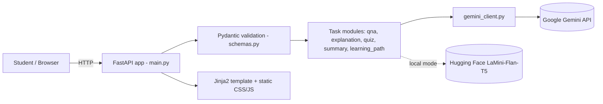
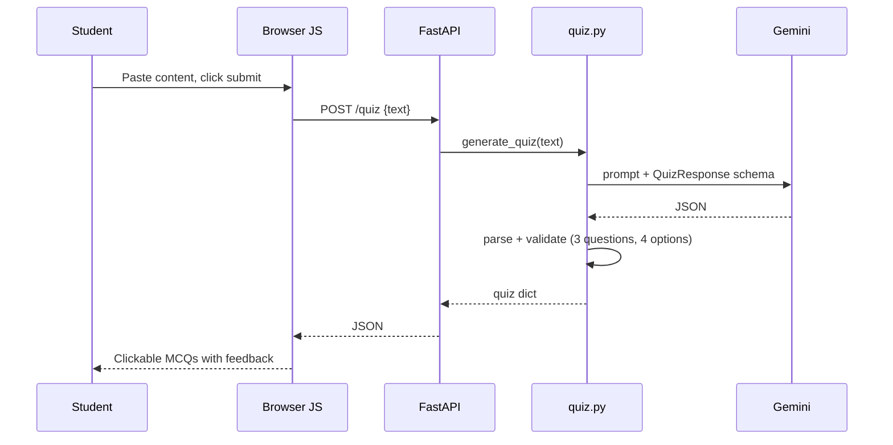

# Phase 3 – Project Design

## 1. System Architecture

## 2. Module Design
| File | Responsibility |
|---|---|
| `main.py` | FastAPI app, routes, static files, template |
| `config.py` | Reads settings from `.env` (API key, model, limits, temperature) |
| `schemas.py` | `TaskRequest`, `QuizQuestion`, `QuizResponse` validation |
| `gemini_client.py` | Cached Gemini client; `generate_text`, `generate_structured` |
| `modules/qna.py` | Student Q&A prompt |
| `modules/explanation.py` | Beginner explanation (Gemini or local mode) |
| `modules/quiz.py` | Structured quiz generation + validation |
| `modules/summary.py` | Revision summary |
| `modules/learning_path.py` | 4-week learning plan |
| `modules/common.py` | Friendly error messages |

## 3. API Design
All task endpoints accept `{"text": "<input>"}`.
| Method | Route | Response |
|---|---|---|
| GET | `/` | HTML page |
| GET | `/health` | `{"status":"ok","service":"EduGenie"}` |
| POST | `/qa` | `{"result": "..."}` |
| POST | `/explain` | `{"result": "..."}` |
| POST | `/summarize` | `{"result": "..."}` |
| POST | `/learn/recommendations` | `{"result": "..."}` |
| POST | `/quiz` | `{"questions":[{question, options[4], correct_answer, explanation} x3]}` or `{"error": "..."}` |

## 4. Sequence (Quiz example)

## 5. UI Design
Single page: hero header → input card (task dropdown, textarea, Load Example, Submit, status line) → result card (with Copy button). Quiz results render as clickable options that show correct/incorrect feedback.

## 6. Design Decisions
- Prompt templates instruct the model to avoid invented sources/URLs
- Structured JSON output for quizzes, re-validated with Pydantic
- Provider-agnostic module layer so explanation can switch to a local model
